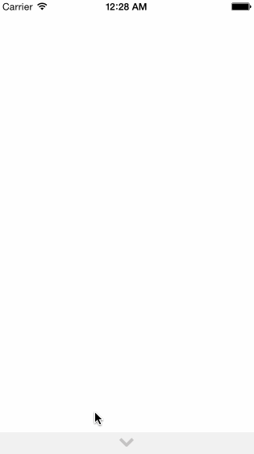

Stuff discussed at week 3 lab that I might have missed:
* How to create a duplicate of ImageView when dragging emoticons
* How to translate coordinates if I want to put the emoticons inside the gray container view

It only works right now because I moved the images outside of the gray drawer container. Not sure how to keep them in the gray container and have coordinates work properly. I know why it doesn't work, but lack the knowledge to make it work.
